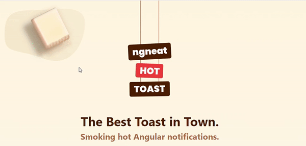

<p align="center">
  <h1 id="ngneat-hot-toast">ngneat hot toast</h1>
  
</p>

<br />

[]()
[]()
[]()
[](https://github.com/prettier/prettier)
[](#contributors-)
[](https://github.com/ngneat/)
[]()

> Smoking hot  Notifications for Angular. Lightweight, customizable and beautiful by default. Inspired from [react-hot-toast](https://github.com/timolins/react-hot-toast)

<p align="center">
 
</p>

## Table of Contents <!-- omit in toc -->

- [Features](#features)
- [Installation](#installation)
  - [NPM](#npm)
  - [Yarn](#yarn)
- [Usage](#usage)
  - [Import Toaster in your app](#import-toaster-in-your-app)
  - [Start toasting](#start-toasting)
- [Examples](#examples)
- [API](#api)
  - [HotToastModule](#hottoastmodule)
    - [forRoot(config?: Partial<ToastConfig>)](#forrootconfig-partialtoastconfig)
  - [HotToastService](#hottoastservice)
    - [show(message: ToastMessage, options?: ToastOptions): CreateHotToastRef](#showmessage-toastmessage-options-toastoptions-createhottoastref)
    - [error(message: ToastMessage, options?: ToastOptions): CreateHotToastRef](#errormessage-toastmessage-options-toastoptions-createhottoastref)
    - [success(message: ToastMessage, options?: ToastOptions): CreateHotToastRef](#successmessage-toastmessage-options-toastoptions-createhottoastref)
    - [loading(message: ToastMessage, options?: ToastOptions): CreateHotToastRef](#loadingmessage-toastmessage-options-toastoptions-createhottoastref)
    - [observe<T>( observable: Observable<T>, messages: ObservableMessages<T>, options?: DefaultToastOptions ): CreateHotToastRef](#observet-observable-observablet-messages-observablemessagest-options-defaulttoastoptions--createhottoastref)
  - [Classes](#classes)
    - [ToastConfig](#toastconfig)
  - [Types](#types)
    - [CreateHotToastRef](#createhottoastref)
      - [Methods](#methods)
      - [Properties](#properties)
    - [ToastOptions](#toastoptions)
    - [Content](#content)
    - [HotToastClose](#hottoastclose)
    - [IconTheme](#icontheme)
    - [ObservableMessages](#observablemessages)
    - [ToastAriaLive](#toastarialive)
    - [ToastMessage](#toastmessage)
    - [ToastMessageInput](#toastmessageinput)
    - [ToastPersistConfig](#toastpersistconfig)
    - [ToastPosition](#toastposition)
    - [ToastRole](#toastrole)
    - [ToastTheme](#toasttheme)
    - [UpdateToastOptions](#updatetoastoptions)
    - [ValueOrFunction](#valueorfunction)
- [Contributors ✨](#contributors-)

## Features

- 🔥 **Hot by default**
- ☕ **Easy to use**
- ♿ **Accessible**
- 😊 **Emoji Support**
- 🛠 **Customizable**
- ⏳ **Observable API** - _Automatic loader from an observable_
- ✋ **Pause on hover** - *No JavaScript, paused through CSS `animation-play-state`*
- 🔁 **Events**
- 🔒 **Persistent** - *Opens one toast at a time with unique id. Can be configured.*
- 🕊 **Lightweight** - _less than ??kb including styles_

## Installation

### NPM

`npm install @ngneat/hot-toast`

### Yarn

`yarn add @ngneat/hot-toast`

## Usage

### Import Toaster in your app

You can set options here.

```typescript
// ..
import { HotToastModule } from '@ngneat/hot-toast';

// ...
@NgModule({
  imports: [HotToastModule.forRoot()],
})

// ...
```

### Start toasting

Call it from anywhere in the component

```typescript
// ...
import { HotToastService } from '@ngneat/hot-toast';

@Component({})
export class AppComponent {
  constructor(private toast: HotToastService) {}
}

showToast() {
  this.toast.show('Hello World!')
}
```

## Examples

You can checkout examples at: <https://ngneat.github.io/hot-toast>.

## API

### HotToastModule

#### forRoot(config?: Partial<ToastConfig>)

Initializes the hot-toast module and creates and appends container component with help of `HotToastService`.

- **Parameters:**
  - `config?` - [`Partial<ToastConfig>`](#toastconfig) - Default configuration options to set for all hot-toasts.

### HotToastService

Service to dispatch Hot Toasts.

#### show(message: ToastMessage, options?: ToastOptions): CreateHotToastRef

Opens up an hot-toast without any pre-configurations.

- **Parameters:**
  - `message` — [`ToastMessage`](#toastmessage) — The message to show in the hot-toast
  - `[options]` — [`ToastOptions`](#toastoptions) — Additional configuration options for the hot-toast
- **Returns:** [`CreateHotToastRef`](#createhottoastref)

#### error(message: ToastMessage, options?: ToastOptions): CreateHotToastRef

Opens up an hot-toast with pre-configurations for error state.

Parameters and Returns are same as [`show`](#showmessage-toastmessage-options-toastoptions-createhottoastref)

#### success(message: ToastMessage, options?: ToastOptions): CreateHotToastRef

Opens up an hot-toast with pre-configurations for success state.

Parameters and Returns are same as [`show`](#showmessage-toastmessage-options-toastoptions-createhottoastref)

#### loading(message: ToastMessage, options?: ToastOptions): CreateHotToastRef

Opens up an hot-toast with pre-configurations for loading state.

Parameters and Returns are same as [`show`](#showmessage-toastmessage-options-toastoptions-createhottoastref)

#### observe<T>( observable: Observable<T>, messages: ObservableMessages<T>, options?: DefaultToastOptions ): CreateHotToastRef

Opens up an hot-toast with pre-configurations for loading initially, subscribes to observable and then changes state based on messages.

- **Parameters:**
  - `observable` — `Observable<T>` — Observable to which subscription will happen and messages will be displayed according to messages
  - `messages`: [`ObservableMessages<T>`](#observablemessages) - Messages for each state i.e. `loading`, `next` and `error`
  - `[options]` — [`ToastOptions`](#toastoptions) — Additional configuration options for the hot-toast
- **Returns:** [`CreateHotToastRef`](#createhottoastref)

You can unsubscribe to observable using `CreateHotToastRef`'s `unsubscribe` method.

### Classes

#### ToastConfig

All options, which are set *Available in global config?* from `ToastOptions` are supported. Below are extra configurable options:

| Name         | Type                                          | Description                                                                                                          |
| ------------ | --------------------------------------------- | -------------------------------------------------------------------------------------------------------------------- |
| reverseOrder | `boolean`                                     | Sets the reverse order for hot-toast stacking<br>*Default: false*                                                    |
| persist      | [`{ToastPersistConfig}`](#toastpersistconfig) | Useful when you want to keep a persistance for toast based on ids, across sessions.<br>*Default: `{enabled: false}`* |
| debug        | `boolean`                                     | Show errors if any. This is disabled in production.<br>*Default: `false`*                                            |

### Types

#### CreateHotToastRef

##### Methods

| Method        | Parameters                                           | Description                       | Returns        |
| ------------- | ---------------------------------------------------- | --------------------------------- | -------------- |
| getToast      | --                                                   | Returns all the toast options     | `ToastOptions` |
| unsubscribe   | --                                                   | Unsubscribes from observable      | --             |
| updateMessage | message: [`Content`](#content)                       | Updates only message              | --             |
| updateToast   | options: [`UpdateToastOptions`](#updatetoastoptions) | Update updatable options of toast | --             |
| close         | --                                                   | Closes the toast                  | --             |

##### Properties

| Name        | Type                                          | Description                                                       |
| ----------- | --------------------------------------------- | ----------------------------------------------------------------- |
| afterClosed | [`Observable<HotToastClose>`](#hottoastclose) | Observable for notifying the user that the toast has been closed. |

#### ToastOptions

Configuration used when opening an hot-toast.

| Name        | Type                              | Description                                                                                                                                                    | Available in global config? |
| ----------- | --------------------------------- | -------------------------------------------------------------------------------------------------------------------------------------------------------------- |
| id          | `string`                          | Unique id to associate with hot-toast. There can't be multiple hot-toasts opened with same id.                                                                 | No                          |
| duration    | `number`                          | Duration in milliseconds after which hot-toast will be auto closed. Can be disabled via `autoClose: false`<br>*Default: `3000, error = 4000, loading = 30000`* | Yes                         |
| autoClose   | `boolean`                         | Auto close hot-toast after duration<br>*Default: `true`*                                                                                                       | Yes                         |
| position    | [`ToastPosition`](#toastposition) | The position to place the hot-toast.<br>*Default: `top-center, theme[snackbar] = top-bottom`*                                                                  | Yes                         |
| dismissible | `boolean`                         | Show close button in hot-toast<br>*Default: `false`*                                                                                                           | Yes                         |
| role        | [`ToastRole`](#toastrole)         | Role of the live region.<br>*Default: `status`*                                                                                                                | Yes                         |
| ariaLive    | [`ToastAriaLive`](#toastarialive) | aria-live value for the live region.<br>*Default: `polite`*                                                                                                    | Yes                         |
| theme       | [`ToastTheme`](#toasttheme)       | Visual appearance of hot-toast<br>*Default: `toast`*                                                                                                           | Yes                         |
| icon        | [`Content`](#content)             | Icon to show in the hot-toast                                                                                                                                  | Yes                         |
| iconTheme   | [`IconTheme`](#icontheme)         | Use this to change icon color                                                                                                                                  | Yes                         |
| className   | `string`                          | Extra CSS classes to be added to the hot toast container.                                                                                                      | Yes                         |
| style       | `any`                             | Extra styles to apply for hot-toast                                                                                                                            | Yes                         |
| closeStyle  | `any`                             | Extra styles to apply for close button                                                                                                                         | Yes                         |

#### Content

```typescript
type Content = string | TemplateRef<any> | Type<any>
```

#### HotToastClose

```typescript
interface HotToastClose {
  /** Whether the snack bar was dismissed using the action button. */
  dismissedByAction: boolean;
  id: string;
}
```

#### IconTheme

```typescript
type IconTheme = {
  primary: string;
  secondary?: string;
};
```

#### ObservableMessages

```typescript
type ObservableMessages<T> = {
  loading?: Content;
  next: ValueOrFunction<Content, T>;
  error?: ValueOrFunction<Content, any>;
};
```

#### ToastAriaLive

```typescript
type ToastAriaLive = 'assertive' | 'off' | 'polite';
```

#### ToastMessage

```typescript
type ToastMessage = ValueOrFunction<Content, ToastMessageInput>;
```

#### ToastMessageInput

```typescript
type ToastMessageInput = Pick<CreateHotToastRef, 'getToast'>;
```

#### ToastPersistConfig

| Name    | Type                  | Description                                                                                                                              |
| ------- | --------------------- | ---------------------------------------------------------------------------------------------------------------------------------------- |
| storage | `'local' | 'session'` | In which storage id vs. counts should be stored<br>*Default: `local`*                                                                    |
| key     | `string`              | The key pattern to store object in storage. `${id}` in pattern is replaced with actual toast id.<br>*Default: `'ngneat/hottoast-${id}'`* |
| count   | `number`              | The number of toasts allowed to show.<br>*Default: `1`*                                                                                  |
| enabled | `boolean`             | Enable or disable persistance.<br>*Default: `false`*                                                                                     |

#### ToastPosition

```typescript
type ToastPosition = 'top-left' | 'top-center' | 'top-right' | 'bottom-left' | 'bottom-center' | 'bottom-right';
```

#### ToastRole

```typescript
type ToastRole = 'status' | 'alert';
```

#### ToastTheme

```typescript
type ToastTheme = 'toast' | 'snackbar';
```

#### UpdateToastOptions

```typescript
type UpdateToastOptions = Partial<
  Pick<
    ToastOptions,
    'icon' | 'duration' | 'dismissible' | 'className' | 'style' | 'iconTheme' | 'type' | 'theme' | 'closeStyle'
  >
>
```

#### ValueOrFunction

```typescript
export type ValueOrFunction<TValue, TArg> = TValue | ValueFunction<TValue, TArg>;
```

---

## Contributors ✨

Thanks goes to these wonderful people ([emoji key](https://allcontributors.org/docs/en/emoji-key)):

<!-- ALL-CONTRIBUTORS-LIST:START - Do not remove or modify this section -->
<!-- prettier-ignore-start -->
<!-- markdownlint-disable -->
<table>
  <tr>
    <td align="center"><a href="https://github.com/shhdharmen"><br /><sub><b>Dharmen Shah</b></sub></a><br /><a href="https://github.com/@ngneat/hot-toast/commits?author=shhdharmen" title="Code">💻</a> <a href="#content-shhdharmen" title="Content">🖋</a> <a href="#design-shhdharmen" title="Design">🎨</a> <a href="https://github.com/@ngneat/hot-toast/commits?author=shhdharmen" title="Documentation">📖</a> <a href="#example-shhdharmen" title="Examples">💡</a></td>
    <td align="center"><a href="https://www.netbasal.com/"><br /><sub><b>Netanel Basal</b></sub></a><br /><a href="https://github.com/@ngneat/hot-toast/issues?q=author%3ANetanelBasal" title="Bug reports">🐛</a> <a href="#business-NetanelBasal" title="Business development">💼</a> <a href="#ideas-NetanelBasal" title="Ideas, Planning, & Feedback">🤔</a> <a href="#maintenance-NetanelBasal" title="Maintenance">🚧</a> <a href="#mentoring-NetanelBasal" title="Mentoring">🧑‍🏫</a> <a href="#projectManagement-NetanelBasal" title="Project Management">📆</a> <a href="#research-NetanelBasal" title="Research">🔬</a> <a href="https://github.com/@ngneat/hot-toast/pulls?q=is%3Apr+reviewed-by%3ANetanelBasal" title="Reviewed Pull Requests">👀</a></td>
  </tr>
</table>

<!-- markdownlint-restore -->
<!-- prettier-ignore-end -->

<!-- ALL-CONTRIBUTORS-LIST:END -->

This project follows the [all-contributors](https://github.com/all-contributors/all-contributors) specification. Contributions of any kind welcome!

<div>Icons made by <a href="http://www.freepik.com/" title="Freepik">Freepik</a> from <a href="https://www.flaticon.com/" title="Flaticon">www.flaticon.com</a></div>
