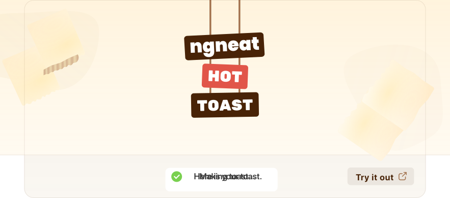

<a href=""></a>

<br />

[]()
[]()
[]()
[](https://github.com/prettier/prettier)
[](#contributors-)
[](https://github.com/ngneat/)
[]()

<div align="center"><strong>Smoking hot  Notifications for React.</strong></div>
<div align="center"> Lightweight, customizable and beautiful by default.</div>

## Table of Contents <!-- omit in toc -->

- [Features](#features)
- [Installation](#installation)
  - [NPM](#npm)
  - [Yarn](#yarn)
- [Usage](#usage)
  - [Import Toaster in your app](#import-toaster-in-your-app)
  - [Start toasting](#start-toasting)
- [Contributors ✨](#contributors-)

## Features

- 🔥 **Hot by default**
- 🔩 **Easily Customizable**
- ⏳ **Observable API** - _Automatic loader from aan observable_
- 🕊 **Lightweight** - _less than ??kb including styles_
- ✅ **Accessible**

## Installation

### NPM

`npm install @ngneat/hot-toast`

### Yarn

`yarn add @ngneat/hot-toast`

## Usage

### Import Toaster in your app

You can set options here.

```typescript
// ..
import { HotToastModule } from '@ngneat/hot-toast';

// ...
@NgModule({
  imports: [HotToastModule.forRoot()],
})

// ...
```

### Start toasting

Call it from anywhere in the component

```typescript
// ...
import { HotToastService } from '@ngneat/hot-toast';

@Component({})
export class AppComponent {
  constructor(private toast: HotToastService) {}
}

showToast() {
  this.toast.show('Hello World!')
}
```

## Contributors ✨

Thanks goes to these wonderful people ([emoji key](https://allcontributors.org/docs/en/emoji-key)):

<!-- ALL-CONTRIBUTORS-LIST:START - Do not remove or modify this section -->
<!-- prettier-ignore-start -->
<!-- markdownlint-disable -->
<table>
  <tr>
    <td align="center"><a href="https://github.com/shhdharmen"><br /><sub><b>Dharmen Shah</b></sub></a><br /><a href="https://github.com/@ngneat/hot-toast/commits?author=shhdharmen" title="Code">💻</a> <a href="#content-shhdharmen" title="Content">🖋</a> <a href="#design-shhdharmen" title="Design">🎨</a> <a href="https://github.com/@ngneat/hot-toast/commits?author=shhdharmen" title="Documentation">📖</a> <a href="#example-shhdharmen" title="Examples">💡</a></td>
  </tr>
</table>

<!-- markdownlint-restore -->
<!-- prettier-ignore-end -->

<!-- ALL-CONTRIBUTORS-LIST:END -->

This project follows the [all-contributors](https://github.com/all-contributors/all-contributors) specification. Contributions of any kind welcome!
